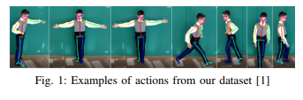

# Human-Robot_Interaction-ROBT414
## Final Project
## Child Action Recognition Based on Our Dataset
The paper presents a continued work on [1], that aims for real-time action recognition specifically tailored for child-centered research. The assumption is that the action recognition model which is trained on videos with adults performing the labeled actions is less accurate with child action recognition, and training the model using dataset where children perform the actions would increase the accuracy. A state-of-the-art method was used with the dataset that was collected by our peers previously. The hypothesis was proven correct, with 33% evaluation accuracy when trained on adults’ actions and 88% evaluation accuracy when trained on children’s actions. Another approach where child actions were recognized is based on 2D Skeleton joints with 24 OpenPose body keypoints. The assumption is that the training on 5 actions with 14 keypoints is more accurate than on 7 actions with 24 keypoints. Finally, the hypothesis for this approach was proven partially, and the best accuracy (test = 85.62%, train = 91.65%) was taken from a training on 5 actions without ’running’ and ’going forward’ with 24 keypoints included.

Index Terms — action recognition, transfer learning, LSTM, RNN, 2D skeleton, robotics, children

